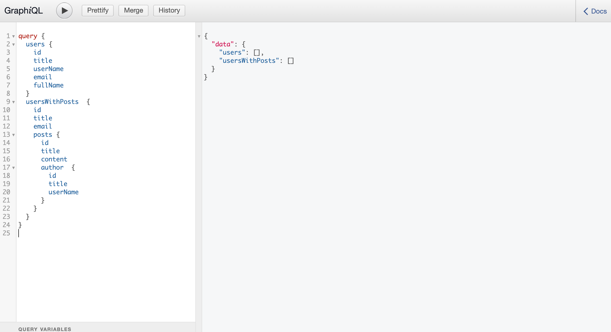
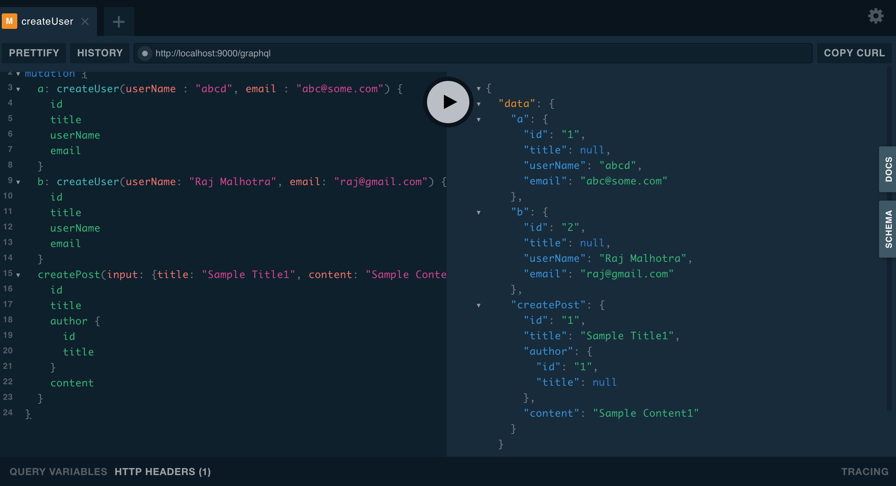
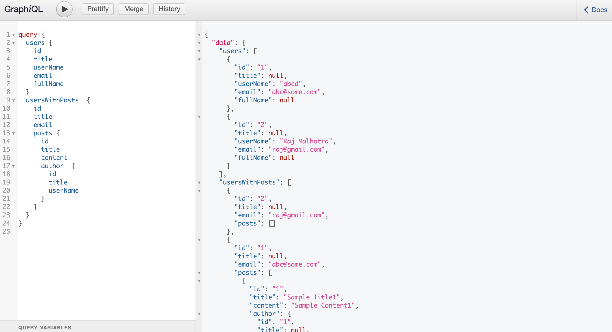
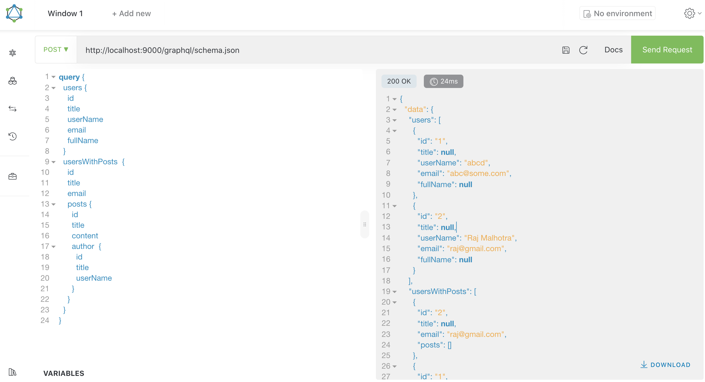
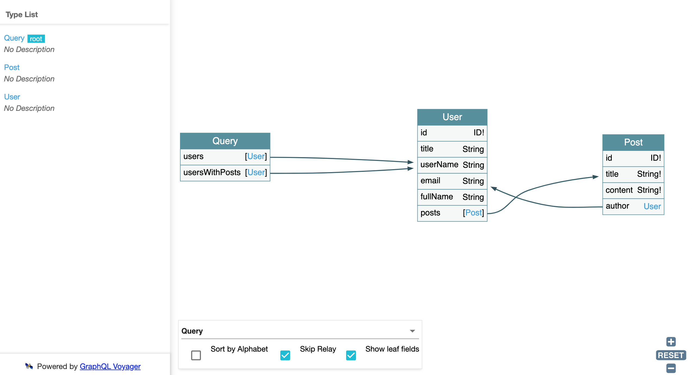

**Example Scenerio**   
This is a Spring Boot, JPA, Postgresql, Graphql project
**User** creates **Post** objects and both can be retrieved as well. Sample urls and requests have been given below

**This involves settings for**
 - Graphiql http://localhost:9000/graphiql
 - Playground http://localhost:9000/playground
 - Altair http://localhost:9000/altair
 - Voyager http://localhost:9000/voyager
 - com.zhokhov.graphql:graphql-datetime-spring-boot-starter:1.7.0

Altair requires schema to be set - http://localhost:9000/graphql/schema.json

Graphql actuator under http://localhost:9000/actuator/metrics
Actuator security - spring.security.user.name: admin, spring.security.user.password: admin

Help - https://github.com/graphql-java-kickstart/graphql-spring-boot

###Sample Mutation
```graphql
mutation {
  a: createUser(userName: "abcd", email: "abc@some.com") {
    id
    title
    userName
    email
  }
  b: createUser(userName: "Raj Malhotra", email: "raj@gmail.com") {
    id
    title
    userName
    email
  }
  createPost(input: {title: "Sample Title1", content: "Sample Content1", authorId: "1"}) {
    id
    title
    author {
      id
      title
    }
    content
  }
}
```

###Sample Query
```graphql
query	{
  users	{
    id
    title
    userName
    email
    fullName
  }
  usersWithPosts	{
    id
    title
    email
    posts	{
      id
      title
      content
      author	{
        id
        title
        userName
      }
    }
  }
}
```

Initial Graphiql
# 

Mutations
# 

Query Graphiql
# 

Query Altair
# 

Voyager
# 
